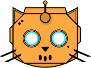

# Discord Queue Bot

  

  
  

A Discord bot that creates and manages game queues for different roles, built with Javascript and hosted on Cloudflare workers.

## Overview

This bot allows Discord server members to create and manage game queues for specific game roles. It runs on Cloudflares workers and the queues are stored using Cloudflare KV.

## Features

- Create game queues for specific roles
- Join, leave or mark as a maybe in queues
- Silent ping option
- Automatically clean up inactive queues
